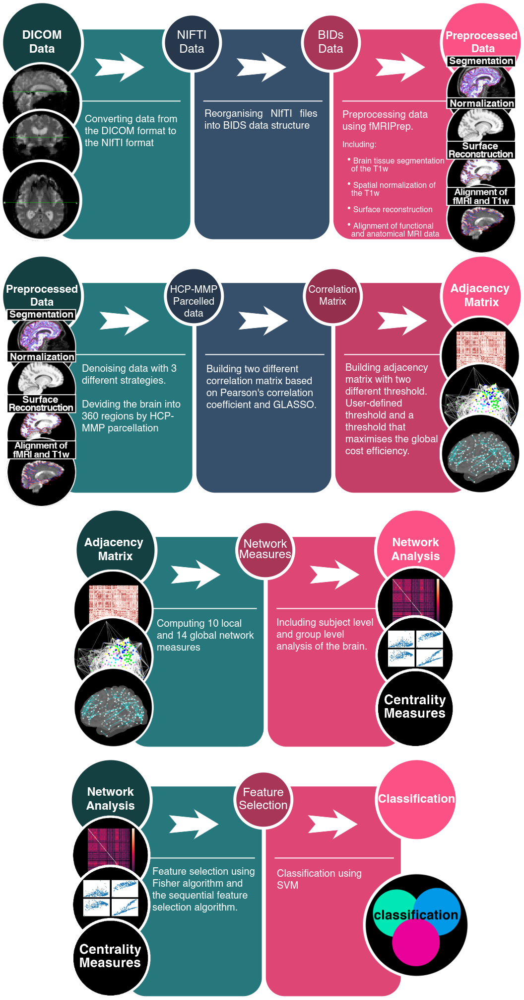

fMRIPrediction
==============================

From fMRI data to making predictions



## Installation 
1. Clone the repository
```bash
git clone https://github.com/Alirezafathian/fmriprediction.git
cd fmriprediction
```
2. Create a create a python3 virtual-env in the main folder (Optional)
3. Install requirements
```bash
pip -m install requirements.txt
```
4. Install <a href="https://www.nitrc.org/projects/dcm2nii" target="_blank">dcm2nii</a> and add it to your PATH environment: 

For example, if you’re using bash, you should add to your ~/.bashrc:
```bash
export PATH="/path/to/mricrone/directory/:$PATH"
```
5. Install <a href="https://fmriprep.org/en/stable/" target="_blank">fMRIPrep</a> using docker 
## Folder Structure
```
.
├── config.py
├── data
│   ├── 00_dicom
│   ├── 01_bids
│   ├── 02_fmriprep
│   ├── 03_time_series
│   ├── 04_correlations
│   ├── 05_adjacency_matrices
│   ├── 06_network_measures
│   ├── 07_group_level
│   ├── 08_features
│   └── subjects_list.csv
├── docs
├── notebooks
│   ├── 00_subjects.ipynb
│   ├── 01_dicom_to_bids.ipynb
│   ├── 02_fMRIPrep_preprocessing.ipynb
│   ├── 03_denoising_and_extracting_time-Series.ipynb
│   ├── 04_estimating_functional_connectivity.ipynb
│   ├── 05_adjacency_matrix.ipynb
│   ├── 06_computing_network_measures.ipynb
│   ├── 07_single_subject_network_analysis.ipynb
│   ├── 08_group_level_network_analysis.ipynb
│   ├── 09_feature_selection.ipynb
│   ├── 10_classification.ipynb
│   └── 11_visualiser.ipynb
├── README.md
├── references
├── reports
├── requirements.txt
└── src
```

<a href="https://github.com/Alirezafathian/fmriprediction/blob/master/docs/folder_structure.md" target="_blank">Here</a> you can see the structure tree in detail. The entire analyzing process was done for subject sub-002S4171 from <a href="http://adni.loni.usc.edu/" target="_blank">ADNI database</a>, and all the results are stored in the repo for a better understanding of the project structure.
## Usage
1. Put the DICOM Images in /fmriprediction/data/00_dicom. 
For each subject a T1w and a fMRI is needed.
```
.
├── data
│   ├── 00_dicom
│   │   ├── sub-002S4746    # the name of folder containing DICOM files should be in this format: sub-<subject ID>
│   │   │   ├── T1w DICOM files
│   │   │   │   └── ...
│   │   │   └── RS-fMRI DICOM files
│   │   │       └── ...
```
Create a file containing subjects info and save it in in /fmriprediction/data/subjects_list.csv and in /fmriprediction/data/01_bids/participants.tsv. This file should be look like <a href="https://github.com/Alirezafathian/fmriprediction/blob/master/data/subjects_list.csv" target="_blank">this</a>.
	
2. Put Freesurfer License in /fmriprediction/references/FSlicense. You can get this from <a href="https://surfer.nmr.mgh.harvard.edu/registration.html" target="_blank">here</a>.

3. Edit the config file in /fmriprediction/config.py

4. Now you can go to /fmriprediction/notebooks and start analyzing your dataset.
